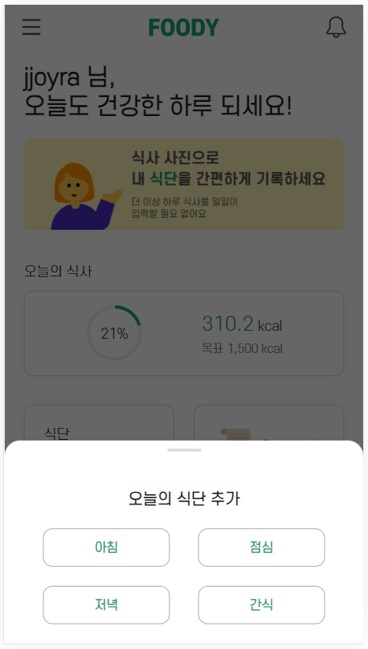
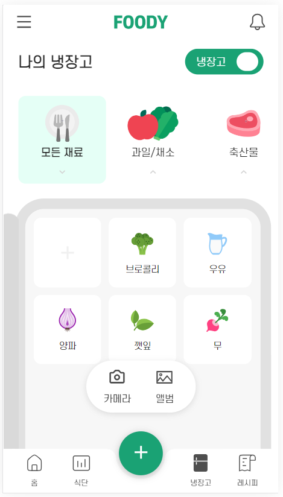
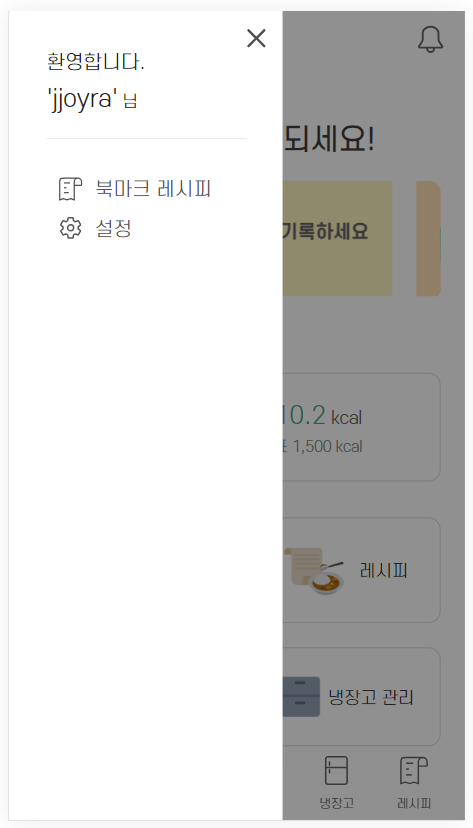
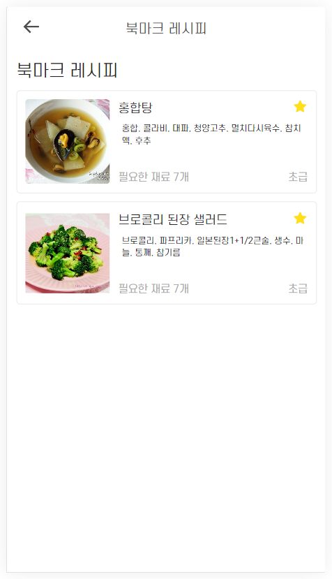

# 🥦 FOODY 🥦

<div align=center>
2023.08.28 ~ 2023.10.06(6주)
</div>

## 🍎 서비스 소개 🍎

<div align=center>


<b>건강한 한 끼의 시작, FOODY</b><br/>

개인 신체 정보에 적절한 권장 영양소와 취향, 보유하고 있는 식재료 등을 고려하여 <br/>
식단 및 레시피를 추천해주는 레시피 추천 서비스입니다.

</div>

## 🍎 핵심 기능 🍎
1. 식사 사진으로 음식을 인식하고 영양소를 분석합니다.
2. 신체 정보를 기준으로 일일 권장 영양소를 계산하여 현재 부족한 영양소를 알려줍니다.
3. 세가지 방식으로 맞춤화 레시피를 추천합니다.
    1. 사용자 취향과 부족 영양소를 기반으로 식사를 추천합니다.
    2. 보유하고 있는 재료와 부족 영양소에 기반으로 추천합니다.
    3. 유사한 사용자의 식사와 사용자의 선호도를 종합하여 추천합니다.
4. 영수증 인식으로 간편하게 식재료를 추가할 수 있고, 보유 식재료를 관리할 수 있습니다.

## 🍎 주요 기술 🍎
1. OCR 기술을 활용한 영수증 인식
2. 이미지 분류 모델 YOLO을 추가학습하여 음식 사진 인식 및 분석에 활용 
3. 10만개 이상의 비정형 음식데이터 가공
4. 사용자의 취향에 기반한 레시피 추천 및추천 로직 최적화
5. 비정형 데이터의 전처리를 하는 Flask서버, FastAPI 서버를 이용하여 YOLO와 빅데이터 추천 시스템을 분리
6. Redis를 활용한 검색어 자동완성 기능 최적화

## 🍎 주요 화면 🍎

|                                                |                                                         |
| :--------------------------------------------: | :-----------------------------------------------------: |
|   |  |
|                   메인페이지                   |                       탭바 + 버튼                       |
|   |  |
|                   식단페이지                   |                        식단 등록                        |
|   |   |
|                 냉장고 페이지                  |                        재료 등록                        |
|   |  |
|               레시피 추천 페이지               |                     레시피 상세보기                     |
|   |   |
|                   마이페이지                   |                         북마크                          |

[**> 화면 GIF 보러가기 <**](./exec/UI/UI.md)

## 🍅 시스템 아키텍쳐 🍅


## 🍅 ERD 🍅


## 🍅 추가 산출물 🍅

- [요구사항 명세서](./exec/requirements/requirements.md)
- [와이어 프레임](./exec/wireframe/wireframe.md)

<!--  -->

## 🥑 Commit Convention 🥑

```jsx
// 작업 종류
init: 프로젝트 셋팅
feat: 새로운 기능 추가할 경우
fix: 버그를 고친 경우
docs: 문서를 수정한 경우(ex. Swagger, README)
style: 코드 포맷팅, 세미콜론 누락, 코드 변경이 없는 경우
refactor: 코드 리팩토링
test: 테스트 코드, 리팩토링 테스트 코드 추가
chore: 빌드 업무 수정, 패키지 매니저 수정(ex. dependency 추가)
merge: 충돌 시 merge할 경우

// 예시
feat: 로그인 API 구현
```

## 🥑 Git Flow 🥑

```jsx
# Branch명
master : 운영 서버로 배포하기 위한 branch
develop : 안정되고 배포 가능한 branch
FE/develop : frontend develop
BE/develop : backend develop
{포지션}/feat/{기능}#{이슈 번호} : 기능 개발을 위한 branch
{포지션}/refactor/{기능}#{이슈 번호} : 리팩토링 branch
{포지션}/hotfix : dev 브랜치에서 발생한 버그를 수정하는 branch

// 예시
BE/feat/user#1

# Pull Request명
브랜치명
# Pull Request 내용
템플릿
```

## 🥑 Jira Convention 🥑

```jsx
- 담당자, 스토리 포인트 지정 필수
- 팀원끼리 스토리 포인트 밸런스 맞추기
- 스토리 포인트 하나 당 4 넘지 않도록 할당
```

## 🥕 팀원 소개 🥕

<!-- |  이름  |      역할      |                         개발 내용                         |
| :----: | :------------: | :-------------------------------------------------------: |
| 신호인 | 팀장, Back-end |                YOLO 모델 학습, CI/CD 구축                 |
| 신상원 |    Back-end    | 추천 알고리즘, 빅데이터 서버 구축, 북마크/레시피/추천 API |
| 이규민 |    Back-end    |              OAuth2, 소셜 로그인, 영양소 API              |
| 조희라 |    Back-end    |        영수증 OCR, 냉장고 API 및 재료 데이터 정제         |
| 임희선 |   Front-end    |         냉장고 관리 구현, 레시피/마이페이지 구현          |
| 김승현 |   Front-end    |        회원가입/로그인/먹BTI 구현, 식단 관리 구현         | -->

<div align="center">

| [](https://github.com/signalman) | [](https://github.com/Shin-sangwon) | [](https://github.com/kkyu-min) |
| :------------------------------------------------------------------------------------------------------------: | :----------------------------------------------------------------------------------------------------------------: | :-----------------------------------------------------------------------------------------------------------: |
|                                                     신호인                                                     |                                                       신상원                                                       |                                                    이규민                                                     |
|                                                    BE, 팀장                                                    |                                                         BE                                                         |                                                      BE                                                       |

| [](https://github.com/jjoyra) | [](https://github.com/wink4u) | [](https://github.com/Im-hass) |
| :---------------------------------------------------------------------------------------------------------: | :----------------------------------------------------------------------------------------------------------: | :----------------------------------------------------------------------------------------------------------: |
|                                                   조희라                                                    |                                                    김승현                                                    |                                                    임희선                                                    |
|                                                     BE                                                      |                                                      FE                                                      |                                                      FE                                                      |

</div>

## 🥕사용 기술🥕

### FrontEnd

- `TypeScript` : 4.9.5
- `React` : 18.2.0
- `Recoil`
- `Axios`
- `styled-component`
- `ESLint`
- `Prettier`

### BackEnd

- `JAVA` : 17
- `Spring` : 2.7.15
  - `Spring Data JPA`
  - `Spring Security`
  - `Spring Rest Docs`
- `Python`
- `FastAPI`
- `MySQL`
- `Redis`

### CI/CD

- `AWS EC2`
- `Jenkins`
- `Docker` : 24.0.6, build ed223bc
- `Amazon S3`
- `NginX` : nginx/1.18.0 (Ubuntu)

### Tool

- `Git`
- `Jira`
- `Notion`
- `Mattermost`
- `Figma`
- `VS Code`
- `intellij`
